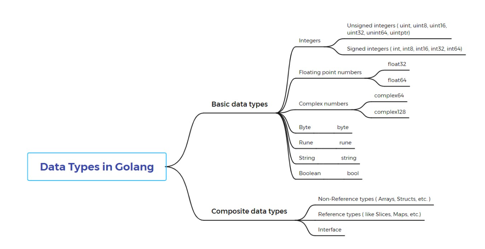

## GoLang is compiled

      GoLang takes less memory than java , c# dont need an entire virtual machine

      Compiles faster 

      but dont get executes faster than rust

      after the execution of go file u get a .exe file which can be run anywhere without executing go build command in their device

      main.go --------> (compiled (go build)) --------> helloworld.exe -----------> executed

## Golang is Strongly Typed
     
      variables can only have a single type not "hello world" can change to a int 3
      
## Go can run multiply files together if u imported something to another file

      go run .\start.go .\var.go  run both the files and main can use funtions from var.go

## Go is garbage collector language 

      in go garbage collected in runtime when u runs a code go adds a extra bit of code to garbage collect from ur code 

## Go datatypes
      
      go sets deafult values to variable if u dont initialize it

      

## Conditonals in go dont surround condition with parenthesis

## function in go
   
   

## Call by value

   in default when a value is assigned to a variable the value stored in memroy and the adress is pointed by the variable ..
   so when u assign a another variable and do this var2 := var1 it makes a another copy of value inside the memory 
   so if u change te value of var2 it dont change the value of var1

## if u dont want a value to implement in ur code 

   just underscore the variable name so it dont throws a error

## Naked return statement 
   
   if function dont return any variable then it will return the parameters