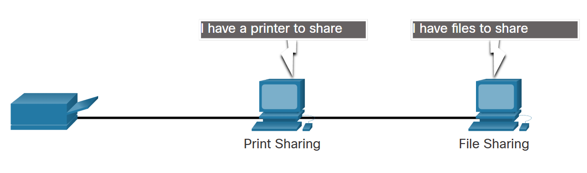

## 1. The Bit

Did you know that computers and networks only work with binary digits, zeros and ones? It can be difficult to imagine that all of our data is stored and transmitted as a series of bits. Each bit can only have one of two possible values, 0 or 1. The term bit is an abbreviation of “binary digit” and represents the smallest piece of data. Humans interpret words and pictures, computers interpret only patterns of bits.

A bit is stored and transmitted as one of two possible discrete states. This can include two directions of magnetization, two distinct voltage or current levels, two distinct levels of light intensity, or any other physical system of two discrete states. For example, a light switch can be either On or Off; in binary representation, these states would correspond to 1 and 0 respectively.

Every input device (mouse, keyboard, voice-activated receiver) will translate human interaction into binary code for the CPU to process and store. Every output device (printer, speakers, monitors, etc.) will take binary data and translate it back into human recognizable form. Within the computer itself, all data is processed and stored as binary.

Computers use binary codes to represent and interpret letters, numbers and special characters with bits. A commonly used code is the American Standard Code for Information Interchange (ASCII). With ASCII, each character is represented by eight bits. For example:

Capital letter: A = 01000001

Number: 9 = 00111001

Special character: # = 00100011

Each group of eight bits, such as the representations of letters and numbers, is known as a byte.

Codes can be used to represent almost any type of information digitally including computer data, graphics, photos, voice, video, and music.

In the figure, enter up to five characters in the Characters field, then click the Show Me button to see the ASCII bit translation. Click Reset to enter a different group of characters.

## 2. Common Methods of Data Transmission

After the data is transformed into a series of bits, it must be converted into signals that can be sent across the network media to its destination. Media refers to the physical medium on which the signals are transmitted. Examples of media are copper wire, fiber-optic cable, and electromagnetic waves through the air. A signal consists of electrical or optical patterns that are transmitted from one connected device to another. These patterns represent the digital bits (i.e. the data) and travel across the media from source to destination as either a series of pulses of electricity, pulses of light, or radio waves. Signals may be converted many times before ultimately reaching the destination, as corresponding media changes between source and destination.

There are three common methods of signal transmission used in networks:

Electrical signals - Transmission is achieved by representing data as electrical pulses on copper wire.

Optical signals - Transmission is achieved by converting the electrical signals into light pulses.

Wireless signals - Transmission is achieved by using infrared, microwave, or radio waves through the air.

## 3. Band Width

In computer networking, bandwidth refers to the maximum amount of data that can be transmitted over a network connection in a given amount of time. It is usually measured in bits per second (bps), such as Mbps (megabits per second) or Gbps (gigabits per second).

## 4. Throughput

Like bandwidth, throughput is the measure of the transfer of bits across the media over a given period of time. However, due to a number of factors, throughput does not usually match the specified bandwidth. Many factors influence throughput including:

The amount of data being sent and received over the connection
The types of data being transmitted
The latency created by the number of network devices encountered between source and destination
Latency refers to the amount of time, including delays, for data to travel from one given point to another.

Throughput measurements do not take into account the validity or usefulness of the bits being transmitted and received. Many messages received through the network are not destined for specific user applications. An example would be network control messages that regulate traffic and correct errors.

In an internetwork or network with multiple segments, throughput cannot be faster than the slowest link of the path from sending device to the receiving device. Even if all or most of the segments have high bandwidth, it will only take one segment in the path with lower bandwidth to create a slowdown of the throughput of the entire network.

There are many online speed tests that can reveal the throughput of an internet connection.

## 5. Client and Server Roles

All computers connected to a network that participate directly in network communication are classified as hosts. Hosts can send and receive messages on the network. In modern networks, computer hosts can act as a client, a server, or both, as shown in the figure. The software installed on the computer determines which role the computer plays.

## 6. Peer-to-Peer Networks

Client and server software usually run on separate computers, but it is also possible for one computer to run both client and server software at the same time. In small businesses and homes, many computers function as the servers and clients on the network. This type of network is called a peer-to-peer (P2P) network.

The simplest P2P network consists of two directly connected computers using either a wired or wireless connection. Both computers are then able to use this simple network to exchange data and services with each other, acting as either a client or a server as necessary.

Multiple PCs can also be connected to create a larger P2P network, but this requires a network device, such as a switch, to interconnect the computers.

The main disadvantage of a P2P environment is that the performance of a host can be slowed down if it is acting as both a client and a server at the same time. The figure lists some of the advantages and disadvantages of peer-to-peer networks.
In larger businesses, because of the potential for high amounts of network traffic, it is often necessary to have dedicated servers to support the number of service requests.

The advantages and disadvantages of P2P networking are summarized in the figure.

The advantages of peer-to-peer networking:

1..Easy to set up

2..Less complex

3..Lower cost because network devices and dedicated servers may not be required

4..Can be used for simple tasks such as transferring files and sharing printers

The disadvantages of peer-to-peer networking:

1..No centralized administration

2..Not as secure

3..Not scalable

4..All devices may act as both clients and servers which can slow their performance

A P2P application allows a device to act as both a client and a server within the same communication, as shown in the figure. In this model, every client is a server and every server is a client. P2P applications require that each end device provide a user interface and run a background service.

Some P2P applications use a hybrid system where resource sharing is decentralized, but the indexes that point to resource locations are stored in a centralized directory. In a hybrid system, each peer accesses an index server to get the location of a resource stored on another peer.

## 7. Multiple Roles in the Network
A computer with server software can provide services simultaneously to one or many clients, as shown in the figure.

Additionally, a single computer can run multiple types of server software. In a home or small business, it may be necessary for one computer to act as a file server, a web server, and an email server.

A single computer can also run multiple types of client software. There must be client software for every service required. With multiple clients installed, a host can connect to multiple servers at the same time. For example, a user can check email and view a web page while instant messaging and listening to internet radio.

## 8. Network Infrastructure
The path that a message takes from its source to destination can be as simple as a single cable connecting one computer to another, or as complex as a network that literally spans the globe. This network infrastructure is the platform that supports the network. It provides the stable and reliable channel over which our communications can occur.

The network infrastructure contains three categories of hardware components, as shown in the figure:

1. End devices

2. Intermediate devices

3. Network media

Devices and media are the physical elements, or hardware, of the network. Hardware is often the visible components of the network platform such as a laptop, PC, switch, router, wireless access point, or the cabling used to connect the devices. Occasionally, some components may not be so visible. In the case of wireless media, messages are transmitted through the air using invisible radio frequencies or infrared waves.

Make a list of the network infrastructure components installed in your home network. Include the cables or wireless access points that provide your network connections.

### End Devices

The network devices that people are most familiar with are called end devices, or hosts. These devices form the interface between users and the underlying communication network.

Some examples of end devices are as follows:

 1. Computers (workstations, laptops, file servers, web servers)

 2. Network printers

 3. Telephones and teleconferencing equipment

 4. Security cameras

Mobile devices (such as smart phones, tablets, PDAs, and wireless debit/credit card readers and barcode scanners)
An end device (or host) is either the source or destination of a message transmitted over the network, as shown in the animation. In order to uniquely identify hosts, addresses are used. When a host initiates communication, it uses the address of the destination host to specify where the message should be sent.

Click Play in the figure to see an animation of data flowing through a network.

## 9. ISP Services

An Internet Service Provider (ISP) provides the link between the home network and the internet. An ISP can be the local cable provider, a landline telephone service provider, the cellular network that provides your smartphone service, or an independent provider who leases bandwidth on the physical network infrastructure of another company.

Many ISPs also offer additional services to their contract subscribers, as shown in the figure. These services can include email accounts, network storage, and website hosting and automated backup or security services.

ISPs are critical to communications across the global internet. Each ISP connects to other ISPs to form a network of links that interconnect users all over the world. ISPs are connected in a hierarchical manner that ensures that internet traffic generally takes the shortest path from the source to the destination.

The internet backbone is like an information super highway that provides high-speed data links to connect the various service provider networks in major metropolitan areas around the world. The primary medium that connects the internet backbone is fiber-optic cable. This cable is typically installed underground to connect cities within continents. Fiber-optic cables also run under the sea to connect continents, countries, and cities.

## 10. ISP Connections

The interconnection of ISPs that forms the backbone of the internet is a complex web of fiber-optic cables with expensive networking switches and routers that direct the flow of information between source and destination hosts. Average home users are not aware of the infrastructure outside of their network. For a home user, connecting to the ISP is a fairly uncomplicated process.

The top portion of the figure displays the simplest ISP connection option. It consists of a modem that provides a direct connection between a computer and the ISP. This option should not be used though, because your computer is not protected on the internet.

As shown in the bottom portion of the figure, a router is required to securely connect a computer to an ISP. This is the most common connection option. It consists of using a wireless integrated router to connect to the ISP. The router includes a switch to connect wired hosts and a wireless AP to connect wireless hosts. The router also provides client IP addressing information and security for inside hosts.